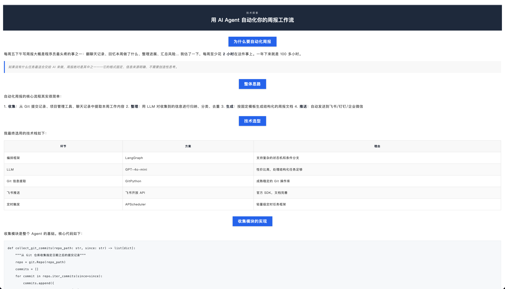

<p align="center">
  <strong>mukun_md_push_wechat</strong><br/><br/>
  <a href="LICENSE"></a>
  <a href="https://python.org"></a>
  
  <br/>
  
  
  
  
  
</p>
<br/>

> 将 Markdown 文件转换为符合微信公众号规范的 HTML 文件，并可一键推送到公众号草稿箱。

## ✨ 功能特性

- 📰 **两种转换模式**：文章模式（默认，长文叙事，配色可配置）和新闻模式（板块化日报，需明确指定 `--news`）
- 🎨 **微信样式兼容**：所有 CSS 内联，使用 `<section>` 替代 `<div>`，规避微信渲染限制
- 📤 **草稿箱推送**：转换后直接上传到微信公众号草稿箱，手动修改原创等信息后，即可发布
- 🖼️ **图片自动上传**：自动解析 Markdown 中的本地图片引用，上传到微信永久素材库并替换为 CDN URL
- 💾 **素材智能缓存**：图片 + 封面图基于文件内容 MD5 缓存到 config.yaml，同一张图片不会重复上传
- 📝 **Frontmatter 支持**：可在 Markdown 文件顶部声明标题和摘要
- 🔧 **多平台兼容**：同时支持 WorkBuddy、Claude Code、OpenCode、Codex CLI

## 📦 安装

本 Skill 遵循通用的 `SKILL.md + scripts/` 结构，可安装到多个主流 AI 编程工具中。

> **注意**：各工具的 skill 目录名（`mukun-md-push-wechat`）即仓库中的 `SKILL.md` 文件夹名。

### 通用方式，用自然语言安装（适用于任何 AI 智能体）

无需安装，直接在对话中把以下内容发给任意 AI 智能体：

```
请读取并安装这个 Skill：
https://raw.githubusercontent.com/MuKunZiAI/mukun_md_push/main/SKILL.md
```

AI 会自动获取 SKILL.md 中的指令并按步骤执行，无需提前配置任何环境。适用于 WorkBuddy、Claude Code、OpenCode、Cursor、Gemini CLI 等所有支持联网读取的智能体。

### 也可以用命令行方式安装

#### WorkBuddy

```bash
# 用户级安装（所有项目可用）
git clone https://github.com/MuKunZiAI/mukun_md_push.git ~/.workbuddy/skills/mukun-md-push-wechat

# 项目级安装（仅当前项目可用）
git clone https://github.com/MuKunZiAI/mukun_md_push.git .workbuddy/skills/mukun-md-push-wechat
```

安装后在对话中直接描述需求即可自动触发（如"把这篇md转成微信html"）。

#### Claude Code

```bash
# 用户级安装（所有项目可用）
git clone https://github.com/MuKunZiAI/mukun_md_push.git ~/.claude/skills/mukun-md-push-wechat

# 项目级安装（团队共享，提交到版本控制）
git clone https://github.com/MuKunZiAI/mukun_md_push.git .claude/skills/mukun-md-push-wechat
```

安装后通过 `/mukun-md-push-wechat` 手动触发，或由 Claude 根据描述自动加载。

#### OpenCode

OpenCode 支持两种安装方式：

##### 方式一：Plugin 模式（推荐，支持自动更新）

在 `opencode.json`（全局或项目级别）中添加插件配置：

```json
{
  "plugin": ["mukun-md-push-wechat@git+https://github.com/MuKunZiAI/mukun_md_push.git"]
}
```

保存后重启 OpenCode，插件会自动安装并注册所有 skills。通过 `use skill tool to load mukun-md-push-wechat` 调用。

##### 方式二：npm 手动安装

适用于 OpenCode 插件管理器无法自动安装的环境（如部分 Windows 版本）：

```bash
npm install mukun-md-push-wechat@git+https://github.com/MuKunZiAI/mukun_md_push.git --prefix "$HOME/.config/opencode"
```

然后在 `opencode.json` 中指向本地包：

```json
{
  "plugin": ["~/.config/opencode/node_modules/mukun-md-push-wechat"]
}
```

##### 方式三：手动 clone（传统方式）

```bash
# 用户级安装
git clone https://github.com/MuKunZiAI/mukun_md_push.git ~/.opencode/skills/mukun-md-push-wechat

# 项目级安装
git clone https://github.com/MuKunZiAI/mukun_md_push.git .opencode/skills/mukun-md-push-wechat
```

安装后输入 `/init` 重新扫描加载，然后通过 `@mukun-md-push-wechat` 或自然语言触发。

> Plugin 模式下，插件会自动将仓库根目录注册为 skills 搜索路径，并注入 `CODEBUDDY_SKILL_DIR` 环境变量，确保 SKILL.md 中的脚本路径在 OpenCode 环境下也能正确解析。

#### OpenAI Codex CLI/APP

Codex CLI 使用 `AGENTS.md` 作为项目级指令文件，Skills 放在 `~/.codex/skills/` 目录下：

```bash
# 将 SKILL.md 复制到 Codex skills 目录
mkdir -p ~/.codex/skills/mukun-md-push-wechat
curl -o ~/.codex/skills/mukun-md-push-wechat/SKILL.md \
  https://raw.githubusercontent.com/MuKunZiAI/mukun_md_push/main/SKILL.md

# 如果需要脚本（转换 HTML 和推送功能依赖 Python 脚本）
git clone https://github.com/MuKunZiAI/mukun_md_push.git /tmp/mukun_md_push
cp -r /tmp/mukun_md_push/scripts ~/.codex/skills/mukun-md-push-wechat/
rm -rf /tmp/mukun_md_push
```

> Codex 的 Skills 是独立 `.md` 文件格式（Description / Input / Steps），而本 Skill 使用 `SKILL.md` + `scripts/` 结构。上述安装方式让 Codex 读取到 SKILL.md 中的指令内容，同时脚本可用于手动调用。

## 💡 使用示例

安装 Skill 后，直接用自然语言告诉 AI 智能体即可：

### 新闻模式

> "帮我把这篇 AI 周报转成新闻模式的微信公众号 HTML"

<p align="center">
  
</p>

### 文章模式（默认风格）

> "把这篇文章转成微信公众号 HTML"

白底灰字，适合技术实践与深度文章：

<p align="center">
  
</p>

### 文章模式（泛黄怀旧）

> "用泛黄怀旧风格把这篇文章转成微信公众号 HTML"

古卷泛黄底色 + 古铜暖棕强调色，适合历史文化类叙事长文：

<p align="center">
  
</p>

### 文章模式（科技蓝紫）

> "用科技蓝紫风格把这篇文章转成微信公众号 HTML"

深邃灰蓝背景 + 蓝紫渐变强调色，适合 AI 科技、技术前沿文章：

<p align="center">
  
</p>

> 完整示例 Markdown 源文件及生成的 HTML 参见 [examples/](examples/) 目录，自定义配色配置文件参见 [examples/config_example.yaml](examples/config_example.yaml)。

### 📝 支持的 Markdown 格式

两种模式支持的 Markdown 语法不完全相同，按场景设计：

#### 新闻模式（`md2news_html.py`）

新闻模式采用「板块 → 条目」解析模型：`## H2` 定义板块，`### H3` 定义条目，`---`/`***` 作为分隔线。

| 语法 | 写法 | 说明 |
|------|------|------|
| H1 主标题 | `# 标题内容` | 文件唯一，第一个 `#` 行即标题 |
| 引用块 | `> 日期 · 概述信息` | 解析为文章的日期/摘要区，支持 `YYYY-MM-DD` 日期提取 |
| H2 板块标题 | `## 行业动态` | 将新闻按板块分组，板块名称默认可映射到配色（如「行业动态」→ 金色） |
| H3 条目标题 | `### 某条新闻标题` | 每条新闻的标题，解析为独立卡片 |
| 分隔线 | `---` 或 `***` | 分隔不同板块或条目 |
| **表格** | `\| 列1 \| 列2 \|` | 紧跟 `###` 条目下方的表格，自动解析为条目附属表格；内容含「⭐」的单元格高亮数字 |
| **粗体** | `**加粗文字**` | 内联加粗 |
| **链接** | `[文字](url)` | 内联超链接 |
| **行内代码** | `` `code` `` | 行内代码样式 |
| **行内图片** | `` | 行内图片（智能跳过 `<code>` 标签内的图片引用） |
| **来源标注** | `来源：链接或说明` | 行首以可配置前缀（默认 `来源：` / `来源:`）开头，识别为来源信息 |
| **页脚声明** | `*声明文字*` | 以 `*` 包裹的行尾声明文字（如「以上内容由 AI 整理」） |

**结构约定**：

```markdown
# 2026-05-26 AI 行业周报

> 2026-05-26 · 本周 AI 行业主要动态概览

## 行业动态

### 某公司发布新产品
产品描述文字，**重点加粗**。[详情链接](https://example.com)。
来源：某某科技

### 行业报告发布
| 类别 | 详情 |
|------|------|
| 行业 | 报告内容 |
| 工具 | 工具内容 |

---

## 模型发布

### GPT-5 正式公布
新的模型在基准测试中表现出色。

*以上内容由 AI 整理，仅供参考*
```

#### 文章模式（`md2article_html.py`）

文章模式采用「顺序段块」解析模型：逐行解析，按 Markdown 语法分类为不同类型的内容块。

| 语法 | 写法 | 说明 |
|------|------|------|
| H1 主标题 | `# 标题内容` | 文件唯一，第一个 `#` 行即标题 |
| H2 章节标题 | `## 章节名` | 渲染为居中底色标签样式（背景色 = `accent`） |
| H3 子标题 | `### 子标题` | 渲染为粗体加黑副标题 |
| 引用块 | `> 引用文字` | 支持连续多行（连续的 `> ` 行合并为一个引用块），渲染为灰底 + 左侧强调色竖线样式 |
| 围栏代码块 | ` ``` ` ... ` ``` ` | 多行代码块，渲染为浅灰底 + 等宽字体（Menlo / Monaco） |
| 分隔线 | `---`、`***` 或 `* * *` | 独立行的分隔线，渲染为段落间的空白分隔 |
| 独立行图片 | `` | 独占一行的图片，渲染为居中块级元素 |
| **表格** | `\| 列1 \| 列2 \|` | 标准 Markdown 表格，自动跳过对齐行，斑马纹交替背景 |
| **粗体** | `**加粗文字**` | 内联加粗 |
| **链接** | `[文字](url)` | 内联超链接 |
| **行内代码** | `` `code` `` | 行内代码样式（灰底 + 强调色文字） |
| **行内图片** | `` | 段落内的图片（智能跳过 `<code>` 标签内的图片引用） |

**结构约定**：

````markdown
# 技术实践：使用 Calcite 实现 SQL 行级权限控制

## 背景

> 引用说明：数据安全是数据平台的核心需求之一...

数据平台的权限控制通常涉及多个维度，其中行级权限是最复杂的。

### 技术选型

Apache Calcite 是一个开源的 SQL 解析与优化框架...

| 维度 | Calcite | 原生 JDBC |
|------|---------|-----------|
| SQL 解析 | 完整 AST | 不支持 |
| 权限注入 | 灵活 | 需自行实现 |

---

## 具体实现

### SQL 解析流程

```java
SqlParser parser = SqlParser.create(sql);
SqlNode node = parser.parseQuery();
```

上述代码完成 SQL 的初始解析。

````

#### 模式差异速查

| 功能 | 新闻模式 | 文章模式 |
|------|:---:|:---:|
| `#` H1 标题 | ✅ | ✅ |
| `> ` 引用块 | ✅（日期/摘要） | ✅（支持多行合并） |
| `##` H2 标题 | ✅（板块切分） | ✅（章节标题） |
| `###` H3 标题 | ✅（条目切分） | ✅（子标题） |
| `---` / `***` 分隔线 | ✅（板块/条目分隔） | ✅（段落分隔） |
| `[链接](url)` | ✅ 内联 | ✅ 内联 |
| `**粗体**` | ✅ 内联 | ✅ 内联 |
| `` `行内代码` `` | ✅ 内联 | ✅ 内联 |
| `` | ✅ 内联 | ✅ 内联 + 独立行 |
| `\| 表格 \|` | ✅（条目附属） | ✅（斑马纹） |
| ` ``` 代码块 ``` ` | ❌ | ✅ |
| `来源：` 标注 | ✅（行首前缀匹配） | ❌（作为普通段落） |
| `*页脚*` 声明 | ✅ | ❌ |
| 结构化板块模型 | ✅（H2 → H3 层级） | ❌ |
| 顺序段块模型 | ❌ | ✅ |

> **选择建议**：AI 日报、行业动态等板块化内容 → 新闻模式；技术实践、深度文章等线性叙述 → 文章模式。

### 🎨 样式配置参考

通过 `~/.md_push_wechat/config.yaml`（或 `--config` 参数）自定义样式。只有两种模式节点：`style.news` 和 `style.article`。

<details>
<summary><b>新闻模式（style.news）— 点击展开</b></summary>

| 配置项 | 默认值 | 说明 |
|--------|--------|------|
| `bg` | `#f5f0e1` | 页面背景色（米黄报纸底色） |
| `card` | `#faf7f0` | 卡片/板块底色 |
| `dark` | `#3c2415` | 深色文字 |
| `heading` | `#3c2415` | 标题颜色 |
| `accent` | `#b8860b` | 强调色（板块名称标签） |
| `rule` | `#c9b99a` | 分隔线颜色 |
| `muted` | `#a08c6a` | 次要文字 |
| `caption` | `#a89880` | 脚注/报尾文字 |
| `hero_bg` | `#2c1810` | 封面标题区底色 |
| `table_bg` | `#f0ead8` | 表头底色 |
| `title_font_size` | `22px` | 文章主标题 |
| `text_font_size` | `15px` | 正文文字 |
| `h2_font_size` | `18px` | H2 板块标题 |
| `card_font_size` | `15px` | 板块内文字 |
| `cover_label` | `AI WEEKLY REVIEW` | 封面副标题 |
| `section_colors` | 见默认值 | 板块名→颜色映射（map） |
| `summary_colors` | 见默认值 | 总结表格类别→颜色映射（map） |
| `summary_sections` | `["总结"]` | 触发总结表格渲染的关键词列表 |
| `source_label` | `"来源："` | 来源标注的显示前缀 |
| `source_prefixes` | `["来源：", "来源:"]` | Markdown 中来源行的检测前缀列表 |

</details>

<details>
<summary><b>文章模式（style.article）— 点击展开</b></summary>

| 配置项 | 默认值 | 说明 |
|--------|--------|------|
| `bg` | `#ffffff` | 页面背景色 |
| `text` | `rgb(85,85,85)` | 正文文字颜色 |
| `accent` | `rgb(198,110,73)` | 强调色（封面底色） |
| `hero_bg` | `rgb(198,110,73)` | 封面标题区底色 |
| `hero_title_color` | `#ffffff` | 封面标题文字颜色 |
| `bold` | `rgb(51,51,51)` | 加粗文字颜色 |
| `rule` | `#ddd` | 分隔线颜色 |
| `caption` | `#888` | 脚注/次要文字 |
| `title_font_size` | `22px` | 文章主标题 |
| `text_font_size` | `16px` | 正文文字 |
| `h2_font_size` | `18px` | H2 标题 |
| `cover_label` | `AI 实践观察` | 封面副标题 |
| `footer` | `""` | 底部署名（空字符串不显示） |
| `ending_lines` | 5 行默认尾栏 | 文末尾栏，`[]` 关闭，支持 HTML 标签 |

</details>

#### 🎨 预设样式速查（自然语言 → 配置文件）

文章模式内置 3 种预设样式，通过 AI 智能体（WorkBuddy/Claude Code 等）用自然语言描述即可自动匹配。也可直接通过 `--config` 传入 `references/` 下的配置文件。

| 预设 | 配置文件 | 视觉特征 | 自然语言触发词 |
|------|---------|---------|--------------|
| 默认 | `references/article_default.yaml` | 白底灰字 + 棕色标签标题 | "默认样式"、"白色"、"白底"、"常规" |
| 泛黄怀旧 | `references/article_nostalgic.yaml` | 古卷泛黄底色 + 古铜暖棕强调色 | "怀旧"、"泛黄"、"古风"、"历史"、"报纸"、"典籍" |
| 科技蓝紫 | `references/article_modern.yaml` | 冷色调蓝紫渐变 + 深色封面 | "科技"、"蓝紫"、"现代"、"AI"、"炫酷" |

```bash
# 直接用 --config 引用预设
python3 scripts/md2wechat_html.py --config references/article_nostalgic.yaml story.md
python3 scripts/push_daily.py --config references/article_modern.yaml story.md
```

#### 🔧 如何新增自定义配置

内置的 3 种预设样式不能满足需求时，有两种方式新增自定义配置：

**方式一：修改全局配置文件**（影响所有未指定 `--config` 的文章模式推送）

直接编辑 `~/.md_push_wechat/config.yaml`，在 `style:` 下增加或修改 `article:` 段：

```yaml
# ~/.md_push_wechat/config.yaml
wechat:
  appid: "wx..."
  secret: "..."

style:
  article:
    bg: "#f8f9fa"
    accent: "rgb(0,150,136)"
    hero_bg: "rgb(0,150,136)"
    cover_label: "我的专栏"
```

**方式二：创建独立配置文件**（推荐，可版本管理、可分享）

1. 从 `references/` 目录复制一个预设配置文件（如 `article_default.yaml`）
2. 修改其中的颜色、字体、封面标签等字段
3. 通过 `--config` 参数指定该文件：

```bash
# 转换 HTML
python3 scripts/md2wechat_html.py --config /path/to/my_style.yaml my_article.md

# 转换 + 推送
python3 scripts/push_daily.py --config /path/to/my_style.yaml my_article.md --digest "..."
```

**最简自定义示例**（只覆盖你想改的字段，其余用代码默认值）：

```yaml
# my_style.yaml
style:
  article:
    bg: "#f0f4f8"
    accent: "rgb(22,138,173)"
    hero_bg: "rgb(22,138,173)"
    cover_label: "技术随笔"
```

可覆盖字段见上方「文章模式 style.article 配置项参考」表格。所有颜色支持 HEX (`#rrggbb`) 或 `rgb(r,g,b)` 格式。

> **提示**：如果有多个系列文章需要不同配色，建议用方式二（独立配置文件），推送时分别指定 `--config`。

## 🚀 使用方式

### 仅转换 HTML

```bash
# 文章模式（默认）
python3 scripts/md2wechat_html.py story.md

# 新闻模式
python3 scripts/md2wechat_html.py --news article.md

# 使用自定义配色配置
python3 scripts/md2wechat_html.py --config /path/to/my_theme.yaml story.md

# 或直接调用独立脚本
python3 scripts/md2news_html.py article.md
python3 scripts/md2article_html.py --config /path/to/my_theme.yaml story.md
```

### 转换 + 推送草稿箱

推送前需要配置 `~/.md_push_wechat/config.yaml`：

```yaml
wechat:
  appid: your_appid
  secret: your_secret
```

#### 图片自动上传与缓存

脚本在推送时会自动处理 Markdown 中的本地图片引用（``）：

1. 从 Markdown 中解析所有 `` 图片引用
2. 解析到本地文件（支持相对路径、绝对路径、alt 描述模糊匹配）
3. 计算文件内容的 **MD5 hash**，先在 `config.yaml` 的 `image_cache.content` 中查找缓存
4. **命中缓存** → 直接复用微信 CDN URL，无需重新上传
5. **未命中** → 通过微信永久素材接口 `cgi-bin/material/add_material` 上传，获取 CDN URL 后写入缓存

封面图同理，基于文件内容 MD5 缓存到 `image_cache.cover` 段，同一张封面图无论路径如何变化都会被识别并永久复用。

**缓存结构**（自动写入 `config.yaml`，无需手动维护）：

```yaml
image_cache:
    cover:
        <md5_hash>: "<media_id>"
    content:
        <md5_hash>: "<CDN URL>"
```

> **关键优势**：同一张图片无论放在哪个目录、叫什么文件名，只要文件内容相同，MD5 hash 就相同，永远不会被重复上传。彻底避免多次推送时图片重复上传导致微信公众号永久素材库被打爆的问题。

```bash
# 文章模式推送（默认）
python3 scripts/push_daily.py story.md

# 新闻模式推送
python3 scripts/push_daily.py --news article.md

# 自定义标题、封面图、摘要
python3 scripts/push_daily.py story.md --title "自定义标题" --cover ./封面图.png --digest "自定义摘要"
```

## 📁 目录结构

```
mukun_md_push/
├── package.json                # NPM 包定义（OpenCode/Codex 插件安装）
├── SKILL.md                    # Skill 定义文件（各工具通用入口）
├── .opencode/
│   └── plugins/
│       └── mukun-md-push-wechat.js  # OpenCode 插件入口
├── scripts/
│   ├── md2wechat_html.py       # 统一入口（模式路由 + 参数解析）
│   ├── md2news_html.py          # 新闻模式转换器
│   ├── md2article_html.py       # 文章模式转换器
│   └── push_daily.py            # 转换 + 推送草稿箱脚本
├── references/                  # 文章模式预设样式（自然语言 → 配置文件）
│   ├── article_default.yaml     # 默认样式（白底灰字）
│   ├── article_nostalgic.yaml   # 泛黄怀旧样式（古卷暖棕）
│   └── article_modern.yaml      # 科技蓝紫样式（冷色调）
├── examples/
│   ├── config_example.yaml              # 完整配置示例（news + article 所有可配置项）
│   ├── default/                         # 默认配色示例（源文件 + 生成 HTML）
│   │   ├── news_example.md                   # 新闻模式源文件
│   │   ├── news_example.html                 # 新闻模式 HTML（生成，默认报纸配色）
│   │   ├── article_example.md                # 文章模式源文件（AI 技术实践）
│   │   ├── article_example.html              # 文章模式 HTML（生成，默认 AI 风格配色）
│   ├── nostalgic/                     # 泛黄怀旧配色方案（自含源文件+配置+HTML）
│   │   ├── config_nostalgic.yaml
│   │   ├── article_nostalgic_example.md      # 文章模式源文件（成语典故）
│   │   └── article_nostalgic_example.html    # 文章模式 HTML（生成，怀旧配色）
│   └── modern/                        # 现代化蓝紫配色方案
│       ├── config_modern.yaml
│       └── article_modern_example.html       # 文章模式 HTML（生成，使用 default/article_example.md 源文件）
├── LICENSE
└── README.md
```

## 📱 扫码关注公众号“木昆子记录AI”

<p align="center">
  <br/><br/>
  <sub>专注分享 AI 落地工程化经验和 AI 产品及工具使用心得</sub>
</p>


## 📋 修改说明

### 2026-05-28

- **代码块编辑模式兼容性全面修复**：微信编辑器编辑模式会 normalize 空白字符并 strip CSS 属性，导致代码块的换行、横向滚动、缩进三项全部失效。修复方案分三层：
  - **换行**：不再依赖 `\n`（会被 normalize），每行独立 `<code style="display:block">` 块级元素，换行由 DOM 结构天然保证
  - **横向滚动**：`section[overflow:auto]` 提供滚动容器，`code[white-space:nowrap]` 阻止长行折行（编辑模式下 `white-space:pre` 会被 strip，`nowrap` 不受影响）
  - **缩进**：`white-space:nowrap` 会折叠行首空白 → 将前导空格转为 `&nbsp;`、制表符转为 4×`&nbsp;`（HTML 实体不被微信编辑器折叠），既保留缩进视觉效果又不影响滚动
- **列表编辑模式多余空行修复**：`_render_list_block()` 生成的 HTML 中 `<li>` 元素间包含 `\n`，微信编辑器将其解释为新的空列表项，产生带项目符号的多余空行。改为紧凑拼接（`''.join(items_html)`），去除所有元素间换行
- **文章模式列表解析增强**：`parse_article()` 引入 `list_stack` 缩进追踪，支持嵌套列表（无限层级）、任务列表（`- [ ]`/`- [x]`）、混合标记符（`-`/`*`/`+`）；`generate_html()` 新增 `_render_list_block()` 递归渲染；修复不同类型兄弟列表（ol/ul/task）的错误嵌套

### 2026-05-27

- **默认模式切换**：从新闻模式（`--news`）改为文章模式（`--article`）作为默认。`md2wechat_html.py` 中 `mode = "article"`，`push_daily.py` 中 `article_mode = True`，新增 `--news` 参数用于显式指定新闻模式。SKILL.md 中新增默认模式决策规则：仅当用户明确说"新闻模式"或上文在讨论新闻日报时才使用 `--news`
- **文章模式新增列表解析**：`md2article_html.py` 的 `parse_article()` 新增有序列表（`1. 2. 3. ...` 正则 `^(\d+)\.\s+(.+)$`）和无序列表（`- * +` 正则 `^[\-\*\+]\s+(.+)$`）的检测与解析，连续同类型列表项自动合并为一个 block。`generate_html()` 新增 `<ol>` 和 `<ul>` 渲染分支，列表项支持内联粗体、代码等格式
- **代码块横向滚动修复**：`render_code_block()` 中行分隔从 `<br>` 改为 `\n`，使 `white-space: pre` 正确生效；CSS 新增 `word-break: normal`、`overflow-wrap: normal`、`-webkit-overflow-scrolling: touch` 防御属性，确保长行代码不换行、出现横向滚动条

### 2026-05-26

- **README 新增「支持的 Markdown 格式」章节**：分别列举新闻模式（12 种语法 + 结构约定示例）和文章模式（12 种语法 + 结构约定示例），附带两种模式的差异速查表和选择建议
- **新增 `references/` 预设样式目录**：文章模式 3 种预设样式（默认/泛黄怀旧/科技蓝紫）独立为 YAML 配置文件，SKILL.md 中加入自然语言 → 样式映射规则，用户说"怀旧风格""科技蓝紫"等即可自动匹配。也可直接 `--config references/article_nostalgic.yaml` 使用
- **移除 20000 字符拆分限制**：删除了 `push_daily.py` 中的 `MAX_CONTENT_LENGTH`、`split_html_content`、`_push_multi_drafts`、`_truncate_title` 等函数，以及 `md2article_html.py`/`md2news_html.py` 中的字符限制警告。现在任意长度的内容都可以一次性推送，不再自动拆分
- **图片素材自动上传与 MD5 缓存**：推送时自动解析 Markdown 中的本地图片引用，通过微信永久素材接口 `cgi-bin/material/add_material` 上传。基于文件内容 MD5 hash 缓存到 `config.yaml` 的 `image_cache.content` 段，同一张图片仅首次上传，后续直接复用 CDN URL
- **封面图 MD5 缓存**：封面图 media_id 同样基于文件内容 MD5 缓存到 `config.yaml` 的 `image_cache.cover` 段，同一张封面图永久复用
- **旧缓存自动迁移**：首次运行时自动将旧的 `image_asset_map.json` 和 `cover_media_id.txt` 迁移到 `config.yaml` 的新缓存格式
- **修复 `--update` 参数顺序 bug**：`--update` 放在输入文件之前会误将文件名当作 media_id。统一约定 `input.md --update` 顺序，文档中所有示例已更新
- **新闻模式中文标题配置化**：`来源：` 标签从代码硬编码改为从 `style.news.source_label` 读取（默认 "来源："），Markdown 来源行检测前缀改为从 `source_prefixes` 列表读取（默认 ["来源：", "来源:"]）
- **HTML 模板清理**：移除新闻模式模板中的中文 HTML 注释

### 2026-05-25

- **模式重构：三模式简化为两模式 + 文件重命名**
  - `md2news_html.py`：新闻模式（原 daily），独立脚本，板块化内容 + 报纸配色，通过 `style.news` 配置
  - `md2article_html.py`：文章模式（原 essay + ai 合并），统一长文渲染，默认 AI 风格配色（白底灰字），通过 `style.article` 配置可切换为泛黄怀旧等任意风格
  - `md2wechat_html.py`：统一入口（wrapper），负责模式路由和配置参数解析，`--news`/`--article` 标志，默认为 `--news`
  - 模板文件全部重命名：`daily_example.*` → `news_example.*`，`ai_article_example.*` → `article_example.*`，`essay_example.*` → `article_nostalgic_example.*`
- **push_daily.py 同步更新**：使用 `--article` 标志，封面图处理合并为统一的文章模式逻辑
- **配置结构调整**：`style.ai`/`style.essay` 统一为 `style.article`，example 配置文件同步更新
- **配置解析器增强**：新增 `ending_lines: []` 空列表支持，用于关闭文章模式尾栏
- **示例全部重新生成**：所有 HTML 预览文件用新脚本重新生成（daily→news 模式，essay/ai→article 模式+对应配色）
- **新增 `examples/config_example.yaml`**：完整配置示例，覆盖 news/article 两种模式下所有可配置项及默认值
- **README 新增样式配置参考章节**：折叠式展开两个模式的完整配置项表格，方便查阅
- **README/SKILL.md/package.json**：全部更新为两模式描述

### 2026-05-24

- **日报分类颜色可配置**：`SECTION_COLORS` 从硬编码改为从 `config.yaml` 的 `daily.section_colors` 读取。用 `板块名: 颜色值` 的 map 格式配置，配置后完整覆盖默认值，未匹配的板块名用 `accent` 兜底。使得「科技前沿」、「金融动态」等任意自定义板块名都能有独立配色
- **总结表格类别颜色可配置**：`render_summary_table()` 中 "行业/工具/模型/研究" 四个硬编码类别标签颜色改为从 `daily.summary_colors` 读取，支持完全自定义
- **总结板块判断可配置**：之前固定判断板块名包含「总结」才渲染为总结表格，改为从 `daily.summary_sections` 读取关键词列表（默认 `["总结"]`）。包含列表中任意关键词即触发总结渲染，支持「汇总」、「本期总结」等不同写法
- **YAML 解析器扩展**：`load_style_config()` 新增支持三级嵌套 map（`section_colors`/`summary_colors`）和列表（`summary_sections`），支持含中文的 key（板块名）
- **底部结尾文字全部可配置**：
  - daily 模式：封面副标题（默认 `"AI WEEKLY REVIEW"`）改为 `daily.cover_label` 可配置
  - ai 模式：尾栏固定文字（—End—、三连、关注+星标、支持感谢、版权声明）改为 `ai.ending_lines` 列表可配置，每项渲染为一个段落，支持内嵌 HTML 标签
  - essay 模式：`footer`（底部署名）与 `cover_label`（封面副标题）已可通过 `essay.footer` / `essay.cover_label` 配置（均含默认值）
- **推送摘要改为 AI 自动生成**：之前推送草稿箱时，若未手动指定 `--digest` 则直接截取正文前 120 字符，产生不完整无意义的截断。改为在 SKILL.md 中指示 AI agent 先读取文章内容、自动生成 120 字以内的精炼摘要再通过 `--digest` 传入。frontmatter 中已有 `digest` 时仍优先使用手动值

### 2026-05-23

- **CSS 内联优化**：将 `text-indent`、`font-size`、`color`、`line-height` 等可继承属性提升到父级 `<body>`/`<section>`，减少重复声明。日报模式节省 10.4%，AI 模式节省 4.5%，长文模式节省 6.2%
- **超长文章自动拆分**：HTML 超过 20000 字符时按段落边界自动拆分为多篇，合并到同一个草稿推送，标题自动追加（上/中/下）后缀，智能截断保留后缀（`_truncate_title()`）
- **样式配置外部化**：`md2wechat_html.py` 新增 `load_style_config()` 从 `~/.md_push_wechat/config.yaml` 读取 `style` 节点覆盖内置默认值，支持 daily/ai/essay 三种模式独立配色，纯字符串解析 YAML 不引入额外依赖
- **`--config` 参数**：`md2wechat_html.py` 支持通过 `--config <path>` 指定任意配色配置文件
- **修复代码块缩进丢失**：`parse_essay()` 收集代码块行时改用 `raw`（保留行首空格），修复 YAML、文件树等缩进代码渲染后缩进丢失的问题
- **修复 YAML 值解析**：引号内的 `#` 颜色码不再被误判为注释，`load_style_config()` 正确读取自定义 `config_path` 参数
- **示例按配色方案分目录**：`examples/` 下新增 `default/`、`nostalgic/`（泛黄怀旧）、`modern/`（科技蓝紫）三个子目录，各含配置文件和示例 HTML

## 📄 License

MIT
