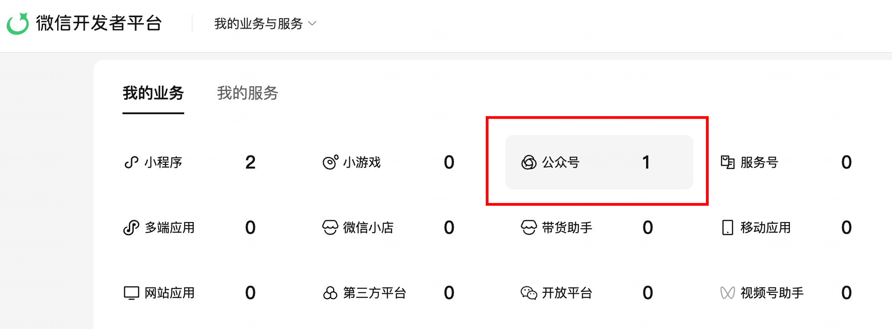
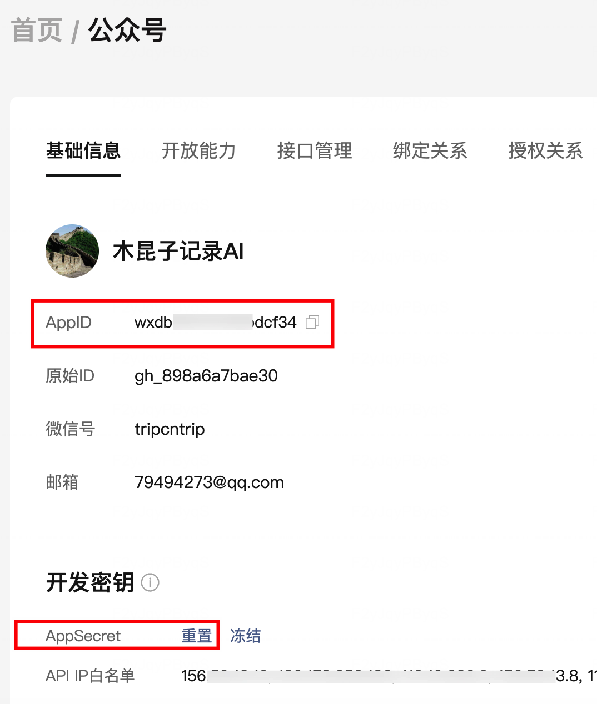

要想通过调用微信官方提供的API接口，推送文章到公众号草稿箱，需要提前从微信开发者平台中拿到你的公众号的访问凭证，并设置好IP访问白名单，具体操作过程如下：

**1. 在微信开发者平台上操作**

访问微信开发者平台地址如下（注意不是微信公众平台），使用公众号管理员微信扫码登录：

```
https://developers.weixin.qq.com/platform
```

登录后，选择要访问的公众号：



点击红框进入公众号的开发设置页面：



然后点击 **AppID** 后面的“复制”图标，将它复制下来。

点击 **AppSecret** 后面的“重置”按钮，在弹出页面中复制好相应的密钥。

最后点击 **API IP白名单** 后面的“编辑”按钮，将你后续要用来访问草稿箱的这台电脑的公网IP地址，加入到编辑框里。

想要知道你的电脑接入公网的IP地址是什么，可以在终端命令行中运行：

```
curl ipv4.ip.sb
```

或者等你实际运行时，微信官方API接口会报错，提示某个访问IP不在白名单，届时你再保存该IP白名单，也可以。

**2. 电脑端参数设置操作**

接下来需要设置你电脑端的参数，新建或编辑当前用户下的配置文件“~/md_push_wechat/config.yaml”，将前面复制到的AppID和AppSecret参数，作为访问凭证信息，保存为如下参数格式：

```
wechat:
  appid: 你复制的 AppID
  secret: 你复制的 AppSecret
```

后续Skill实际运行过程中，会读取以上参数配置信息，作为访问凭证去调用微信公众号的API接口。
